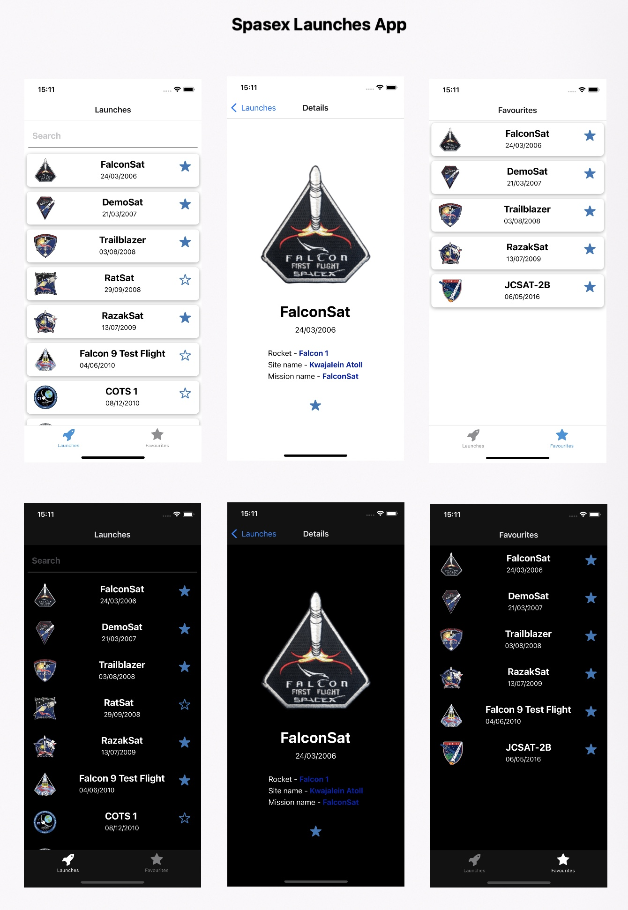

# Spasex Rocket Launches App

## Description
This is a simple app that shows the latest SpaceX rocket launches. It uses the [SpaceX API](https://docs.spacexdata.com) to fetch the data. 

The app is built with **React** and **Redux Toolkit**. It uses **RTK Query** to fetch the data from the API. 

The app uses **Lazy Loading** to load the data in chunks while scrolling.

The app has the possibility to add a launch to favorites and uses **Redux Persist** to persist the data locally. 

The app has a **dark and light mode** and also has a **search** feature.

## Features
- Redux Toolkit
- RTK Query
- Lazy Loading (Infinite Scroll)
- Persisted data locally with Redux Persist
- Dark/Light Mode
- Possibility to add a launch to favorites
- Search

### To start the project, run the following commands:

`yarn install`

`yarn start`
